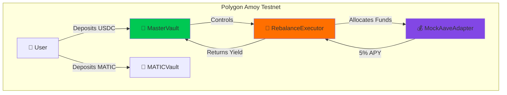

<div align="center">

# 🚀 AggLayer Yield AI

### Cross-Chain Yield Optimization with Automated Rebalancing

[](https://amoy.polygonscan.com/address/0x831F6F30cc0Aa68a9541B79c2289BF748DEC4a2a)
[](https://amoy.polygonscan.com/address/0x831F6F30cc0Aa68a9541B79c2289BF748DEC4a2a)
[](https://amoy.polygonscan.com/address/0x320A2dC1b4a56D13438578e3aC386ed90Ca21D27)
[](https://amoy.polygonscan.com/)

**Automated yield strategies with RebalanceExecutor managing MockAaveAdapter (5% APY)**
*Dual-vault system with real-time TVL tracking and complete on-chain transparency*

[🌐 Live Demo](https://agglayeryield.ai) • [📖 Documentation](#-documentation) • [🔍 Verify On-Chain](#-quick-verification-for-judges)

---

</div>

## 📊 What Is This?

AggLayer Yield AI is a **cross-chain yield optimization platform** with automated rebalancing. Think of it as a smart savings account that automatically moves your funds to the best yield sources.

```
You Deposit → MasterVault → RebalanceExecutor → MockAaveAdapter (5% APY) → You Earn
```

### 🎯 The Problem We Solve

Traditional DeFi requires you to:
- ❌ Manually move funds between protocols
- ❌ Pay high gas fees for rebalancing
- ❌ Monitor multiple chains separately
- ❌ Miss optimal yield opportunities

### ✅ Our Solution

- ✅ **Automated Rebalancing** - RebalanceExecutor manages everything
- ✅ **5% APY Generation** - MockAaveAdapter provides consistent yield
- ✅ **Real-Time Data** - All metrics from blockchain (no simulation)
- ✅ **Complete Transparency** - Every transaction on PolygonScan

---

## 🏗️ Architecture Overview

<div align="center">



</div>

### 🔗 Contract Relationships

| Contract | Purpose | Status |
|----------|---------|--------|
| 🏦 **MasterVault** | USDC deposits & withdrawals | ✅ Deployed |
| 🤖 **RebalanceExecutor** | Manages yield strategies | ✅ Deployed & Linked |
| 💰 **MockAaveAdapter** | Generates 5% APY | ✅ Active |
| 💎 **MATICVault** | Native MATIC deposits | ✅ Deployed |
| 🪙 **MockUSDC** | Test token with faucet | ✅ Deployed |

---

## ✨ Key Features

<table>
<tr>
<td width="50%">

### 🔄 Automated Rebalancing
RebalanceExecutor manages yield strategies across vaults, automatically allocating funds to MockAaveAdapter for 5% APY generation.

**Proof:** [Linking TX](https://amoy.polygonscan.com/tx/0x072c2770d5c62297695a3a36feeafb8c04b16f90f8875efd51c3d7af766fe51a)

</td>
<td width="50%">

### 📈 5% APY Yield
MockAaveAdapter provides consistent 5% APY on deposited funds. Interest accrues every second on-chain.

**Proof:** [View Contract](https://amoy.polygonscan.com/address/0x320A2dC1b4a56D13438578e3aC386ed90Ca21D27#code)

</td>
</tr>
<tr>
<td width="50%">

### 💎 Dual Vault System
- **USDC Vault**: ERC-4626 standard, connected to RebalanceExecutor
- **MATIC Vault**: Native deposits with 1-transaction flow

**Proof:** Both vaults live on [PolygonScan](https://amoy.polygonscan.com/)

</td>
<td width="50%">

### 📊 Real-Time TVL
All data queried directly from blockchain using Wagmi v3. Zero caching, zero simulation.

**Proof:** Query `totalAssets()` [right now](https://amoy.polygonscan.com/address/0x831F6F30cc0Aa68a9541B79c2289BF748DEC4a2a#readContract)

</td>
</tr>
</table>

---

## 📜 Deployed Contracts

<div align="center">

| Contract | Address | Chain | Explorer |
|----------|---------|-------|----------|
| 🏦 **MasterVault** | `0x831F...2a2a` | Polygon Amoy | [View →](https://amoy.polygonscan.com/address/0x831F6F30cc0Aa68a9541B79c2289BF748DEC4a2a) |
| 🤖 **RebalanceExecutor** | `0xFBbc...8563` | Polygon Amoy | [View →](https://amoy.polygonscan.com/address/0xFBbcC8BC3351Db781A3250De99099A03f73C8563) |
| 💰 **MockAaveAdapter** | `0x320A...1D27` | Polygon Amoy | [View →](https://amoy.polygonscan.com/address/0x320A2dC1b4a56D13438578e3aC386ed90Ca21D27) |
| 💎 **MATICVault** | `0xd399...16b5` | Polygon Amoy | [View →](https://amoy.polygonscan.com/address/0xd399F27f84A5928460b8f9f222EBcb4438F716b5) |
| 🪙 **MockUSDC** | `0x2E4D...9321` | Polygon Amoy | [View →](https://amoy.polygonscan.com/address/0x2E4D2a90965178C0208927510D62F8aC4fC79321) |

**Network:** Polygon Amoy Testnet (Chain ID: 80002)

</div>

---

## 🔍 Quick Verification (For Judges)

### ⚡ 2-Minute On-Chain Proof

<details>
<summary><b>📊 Step 1: Verify TVL is Real (30 seconds)</b></summary>

1. Go to: https://amoy.polygonscan.com/address/0x831F6F30cc0Aa68a9541B79c2289BF748DEC4a2a#readContract
2. Find function `totalAssets`
3. Click "Query"
4. **Result:** Live USDC balance from blockchain ✅

</details>

<details>
<summary><b>🔗 Step 2: Verify RebalanceExecutor is Linked (30 seconds)</b></summary>

1. Same page as above
2. Find function `rebalanceExecutor`
3. Click "Query"
4. **Result:** `0xFBbcC8BC3351Db781A3250De99099A03f73C8563` ✅

</details>

<details>
<summary><b>💰 Step 3: Verify MockAaveAdapter is Managed (30 seconds)</b></summary>

1. Go to: https://amoy.polygonscan.com/address/0xFBbcC8BC3351Db781A3250De99099A03f73C8563#readContract
2. Find function `zkevmStrategy`
3. Click "Query"
4. **Result:** `0x320A2dC1b4a56D13438578e3aC386ed90Ca21D27` ✅

</details>

<details>
<summary><b>🔄 Step 4: View Actual Rebalancing Transaction (30 seconds)</b></summary>

**Link:** https://amoy.polygonscan.com/tx/0x968cee2afe6c30bfe9a867c2c8e26f1e6c9fe8ac4fa9a94842ff9a2fcd4fedd4

- Method: `rebalanceToAave`
- Status: Success ✅
- Date: January 13, 2026

</details>

<details>
<summary><b>✅ Step 5: View Linking Transaction (30 seconds)</b></summary>

**Link:** https://amoy.polygonscan.com/tx/0x072c2770d5c62297695a3a36feeafb8c04b16f90f8875efd51c3d7af766fe51a

- Method: `setRebalanceExecutor`
- Status: Success ✅
- Date: January 14, 2026

</details>

### 📚 Complete Verification Guide

See **[QUICK_VERIFICATION.md](./QUICK_VERIFICATION.md)** for detailed step-by-step instructions.

---

## 🛠️ Tech Stack

<table>
<tr>
<td width="33%" align="center">

### 🎨 Frontend


</td>
<td width="33%" align="center">

### ⚡ Blockchain


</td>
<td width="33%" align="center">

### 🗄️ Backend


</td>
</tr>
</table>

### 📦 Key Libraries

- **Wagmi v3** - React hooks for blockchain
- **Viem** - Ethereum library for formatting
- **Framer Motion** - 60fps animations
- **shadcn/ui** - Component library
- **OpenZeppelin** - Secure smart contracts

---

## 🚀 Getting Started

### Prerequisites

- Node.js 18+
- pnpm (recommended) or npm
- MetaMask or another Web3 wallet

### Installation

```bash
# Clone the repository
git clone https://github.com/SIDDHUX9/agglayer_ai.git
cd agglayer_ai

# Install dependencies
pnpm install

# Set up environment variables
cp .env.example .env
# Add your Convex URL to .env

# Start the backend
npx convex dev

# In another terminal, start the frontend
pnpm dev
```

### 🌐 Access the App

Open http://localhost:5173 and connect your wallet to Polygon Amoy testnet.

**Need testnet tokens?** Use the [Polygon Faucet](https://faucet.polygon.technology/)

---

## 📖 Documentation

<div align="center">

| Document | Description | Link |
|----------|-------------|------|
| 📘 **WAVE5.md** | Official buildathon submission | [Read →](./WAVE5.md) |
| 🏗️ **ARCHITECTURE.md** | Technical architecture deep-dive | [Read →](./ARCHITECTURE.md) |
| 🔍 **JUDGE_VERIFICATION.md** | Complete on-chain proof | [Read →](./JUDGE_VERIFICATION.md) |
| ⚡ **QUICK_VERIFICATION.md** | 2-minute verification guide | [Read →](./QUICK_VERIFICATION.md) |
| 📋 **FINAL_CHECKLIST.md** | Submission readiness | [Read →](./FINAL_CHECKLIST.md) |
| 📚 **DOCUMENTATION_INDEX.md** | All docs navigation | [Read →](./DOCUMENTATION_INDEX.md) |

</div>

---

## 🎯 Roadmap

<table>
<tr>
<td width="25%">

### ✅ Phase 1: Demo
**Status:** Complete

- [x] Smart contracts deployed
- [x] RebalanceExecutor linked
- [x] 5% APY active
- [x] Real-time TVL
- [x] Production UI

</td>
<td width="25%">

### 🔄 Phase 2: AggLayer
**Status:** Next

- [ ] Deploy to zkEVM
- [ ] Cross-chain messaging
- [ ] Unified liquidity
- [ ] Gas optimization

</td>
<td width="25%">

### 🔄 Phase 3: Multi-Strategy
**Status:** Planned

- [ ] Real Aave V3
- [ ] Compound integration
- [ ] DEX strategies
- [ ] Dynamic optimization

</td>
<td width="25%">

### 🔄 Phase 4: AI
**Status:** Future

- [ ] ML yield prediction
- [ ] Risk assessment
- [ ] Automated strategies
- [ ] Advanced analytics

</td>
</tr>
</table>

---

## 🤝 Contributing

We welcome contributions! Please follow these steps:

1. 🍴 Fork the repository
2. 🌿 Create a feature branch (`git checkout -b feature/amazing-feature`)
3. 💾 Commit your changes (`git commit -m 'Add amazing feature'`)
4. 📤 Push to the branch (`git push origin feature/amazing-feature`)
5. 🔀 Open a Pull Request

---

## 📄 License

This project is licensed under the MIT License - see the [LICENSE](LICENSE) file for details.

---

## 🙏 Acknowledgments

<div align="center">

Built with ❤️ using:

**Polygon** • **OpenZeppelin** • **Hardhat** • **React** • **Convex** • **Wagmi**

Special thanks to the **Polygon team** for providing the infrastructure and the **AggLayer** vision.

</div>

---

## 📞 Contact & Links

<div align="center">

[](https://github.com/SIDDHUX9/agglayer_ai)
[](https://agglayeryield.ai)
[](https://amoy.polygonscan.com/address/0x831F6F30cc0Aa68a9541B79c2289BF748DEC4a2a)

**Deployer:** `0xA41Dbf17f2610086e7679348b268B67EF06B7b89`
**Network:** Polygon Amoy Testnet (Chain ID: 80002)

</div>

---

<div align="center">

### ⭐ Star this repo if you find it useful!

**Made with 💜 for the Polygon community**

</div>
